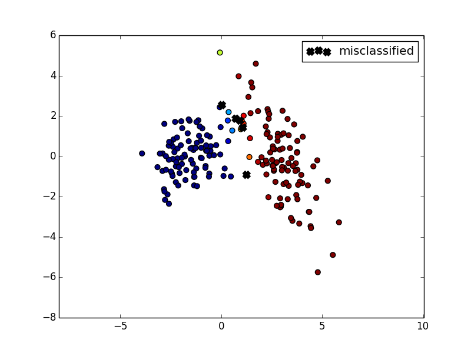
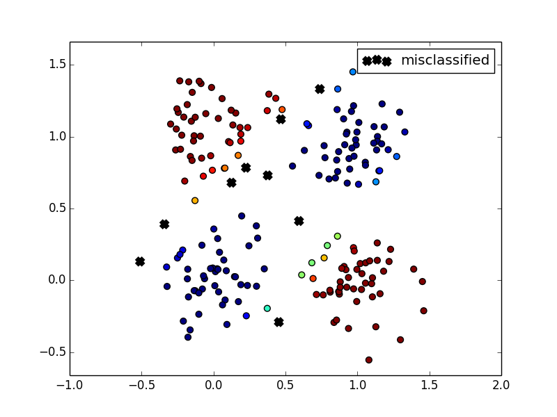

## Demo Tensor Flow Usage

This file provides a high-level view of writing/organizing/testing different TensorFlow models. The dataset is specified inside the `utilities.fakedata`. 

Run using 
    
    python logisticModel.py
    python nnhl1Model.py

### Gaussian data 

### XOR data

